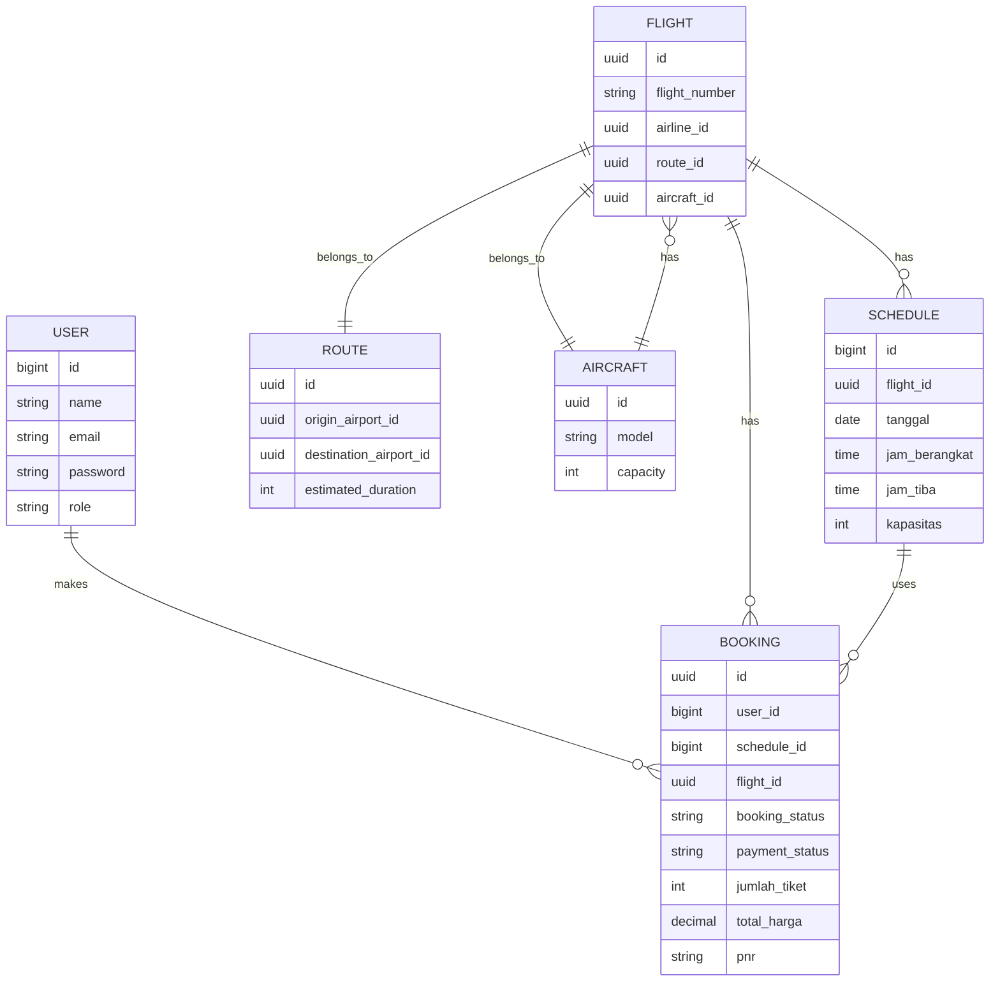

# ERD Database

## Penjelasan Relasi
- `User` memiliki banyak `Booking`.
- `Booking` dimiliki oleh `User`, `Flight`, dan `Schedule`.
- `Flight` dimiliki oleh `Route` dan `Aircraft`.
- `Schedule` dimiliki oleh `Flight`.
- `Aircraft` memiliki banyak `Flight`.
