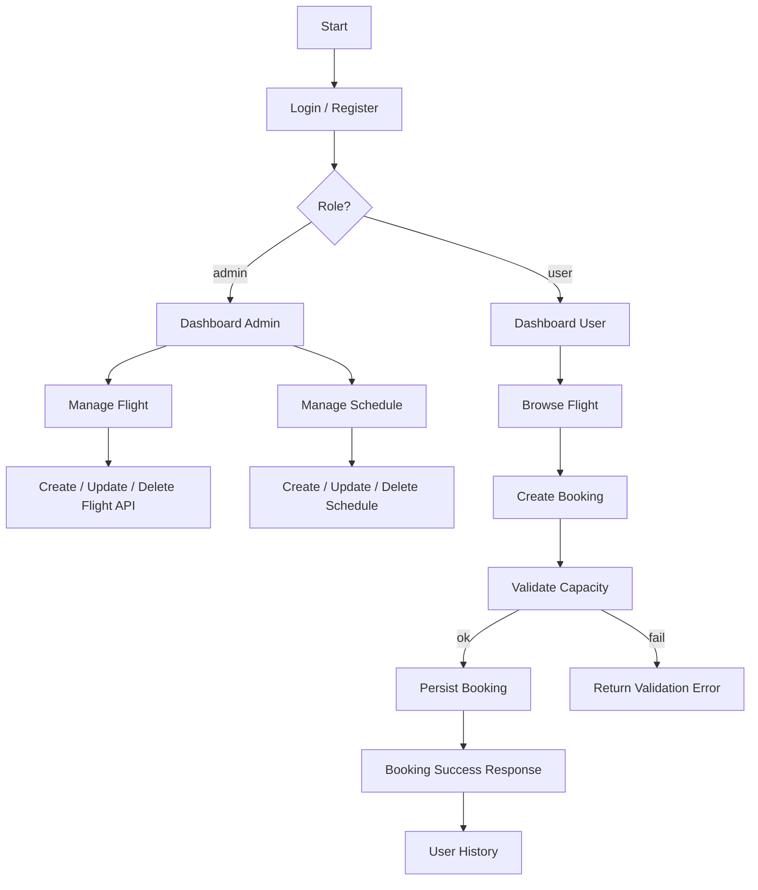

# Flowchart Sistem

## Alur Login
1. User masuk melalui `/login` atau `/api/login`.
2. Sistem memvalidasi email dan password.
3. `Sanctum` mengeluarkan token.
4. Token digunakan pada endpoint API yang dilindungi.
