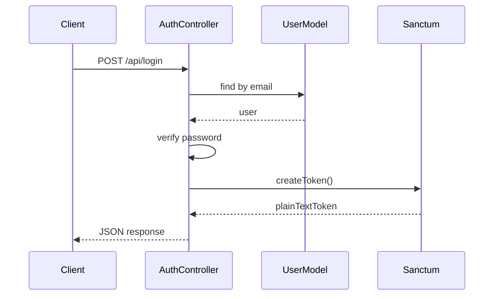

# Penjelasan Alur Login

1. Pengguna membuka halaman login atau memanggil endpoint `POST /api/login`.
2. Request divalidasi menggunakan FormRequest.
3. Sistem mencari user berdasarkan email.
4. Password diverifikasi menggunakan hashing Laravel.
5. Token Sanctum dibuat melalui `createToken()`.
6. Respon JSON mengandung `success`, `message`, `data.user`, dan `data.token`.
7. Token disimpan pada client dan dikirim sebagai `Authorization: Bearer <token>`.

## Flow Login

